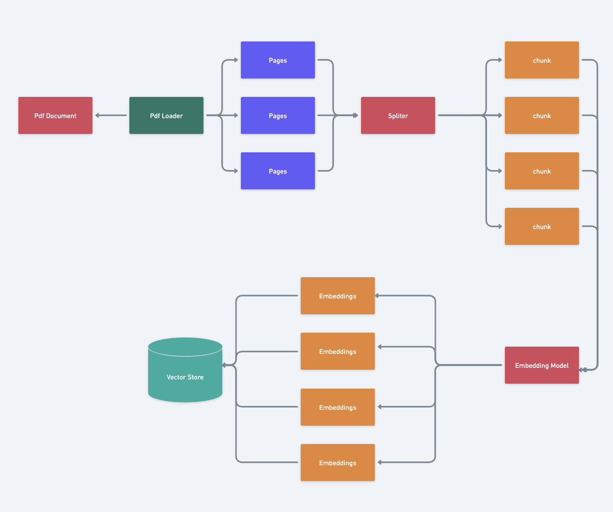
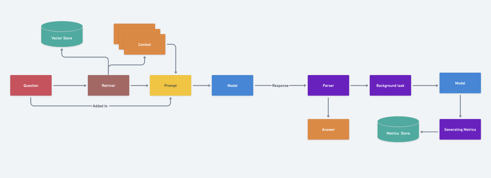

# Technical Report: Implementation of a RAG System for PDF-based Question Answering

## 1. Introduction

This report outlines the implementation of a Retrieval-Augmented Generation (RAG) system designed to answer questions based on the content of a PDF document. The system utilizes an open-source language model, specifically Llama 3.1 8B, and employs various components from the LangChain library to process, store, and retrieve information from the document.

## 2. System Components

The RAG system consists of the following key components:

1. PDF Loader
2. Text Splitter
3. Vector Store
4. Embeddings Generator
5. Retriever
6. Language Model
7. Output Parser
8. Prompt Template

## 3. Implementation Process

### 3.1 Loading the PDF Document

The system uses the PyPDFLoader from LangChain to load the PDF file and break it down into separate pages. This component allows for easy extraction of text content from PDF files, making it accessible for further processing.

### 3.2 Splitting Pages into Chunks

To manage the length of text segments, the RecursiveCharacterTextSplitter is employed to divide pages into smaller chunks. This step is crucial for creating manageable pieces of text that can be effectively embedded and retrieved later.

### 3.3 Creating and Populating the Vector Store

The system generates embeddings for each chunk using OllamaEmbeddings and stores them in a FAISS vector store. This process converts text chunks into numerical vectors, allowing for efficient similarity searches later in the retrieval process.

### 3.4 Setting Up the Retriever

A retriever is configured to find relevant chunks from the vector store based on input questions. This component is responsible for identifying the most relevant pieces of information from the document when a question is asked.

### 3.5 Configuring the Language Model

The system uses the Llama 3.1 8B model through Ollama for generating responses. This large language model is capable of understanding context and generating human-like text responses.

### 3.6 Implementing the Output Parser

A string output parser is used to extract the text answer from the model's response. This component ensures that the output from the language model is in a usable format for the end-user.

### 3.7 Creating the Prompt Template

A prompt template is defined to structure the input for the language model, incorporating both the context and the question. This template guides the model in generating appropriate responses by providing a consistent format for inputs.

### 3.8 Assembling the RAG Chain

The final step involves chaining together all components to create the complete RAG system. This chain orchestrates the flow of information from the initial question, through retrieval of relevant context, to the generation of the final answer.

## 4. Enhanced Functionality: Structured Output

The system was further improved to provide structured output, including sources for the answers. This enhancement involves creating a custom data structure (AnswerWithSources) that includes both the answer text and a list of sources used to generate the answer. This addition increases the transparency and reliability of the system's outputs.

## 5. Usage and Results

The system can be used to answer questions based on the content of the PDF document. Users can input questions, and the system will provide answers along with the sources used to generate those answers. This functionality allows for more informed decision-making and easier fact-checking.

## 6. Conclusion

This implementation demonstrates a functional RAG system capable of answering questions based on PDF content. The system leverages various components from the LangChain library and an open-source language model to achieve this functionality. The structured output enhancement provides additional context by including sources for the generated answers, increasing the system's transparency and reliability.

Future improvements could include:
- Fine-tuning the model for specific domains
- Implementing more sophisticated retrieval methods
- Expanding the system to handle multiple document types
- Improving the accuracy and relevance of retrieved context
- Enhancing the user interface for easier interaction with the system

This RAG system represents a powerful tool for information retrieval and question answering, with potential applications in various fields such as research, customer support, and document analysis.

## Detailed Image of Chunking and Storing Flow

##  Detailed Image of Retrieving and Question-Answering Flow

